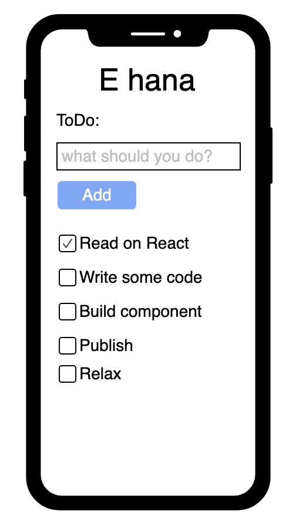

RON LAMBOJON - DONE!

# Code Challenge

The goal of this challenge is to get to know your familiarity building ReactJS Application.

It will be helpful if you will add code comment explaining why you decide to wrote the code block that way or why you implement that way. Please don't put a very long comment!

1. Fork this repository and email the link once your done.
2. Setup a ReactJS development environment using the dependencies already available on the **_package.json_** file.
3. Build and Development configuration should go to **_webpack.config.js_** file.
   - You can build you own configuration using other build tool but not `Create React App`.
4. Create a simple ToDo Application.

   - style and css loader are already available you just need to configure.
   - you can add support for `scss`. (optional)
   - try not to go out of scope of the example mock.

        

# 🍻💯
